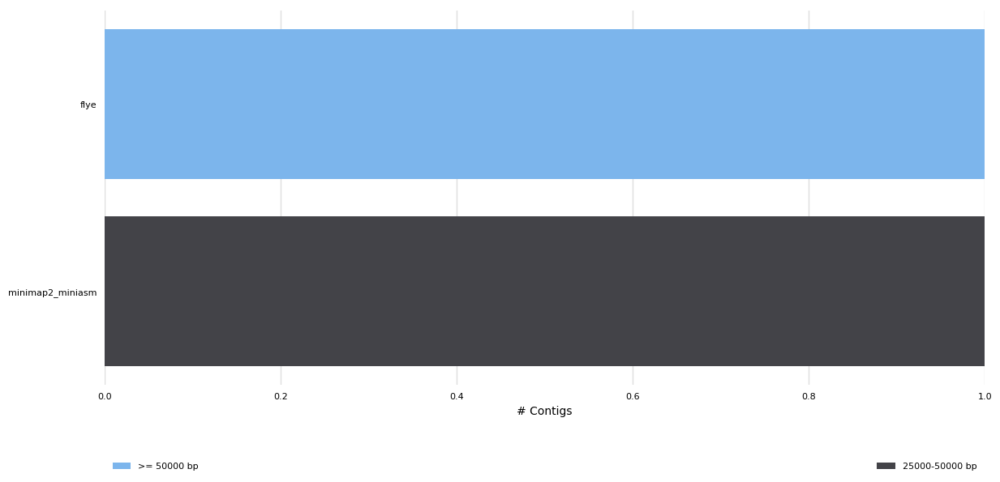
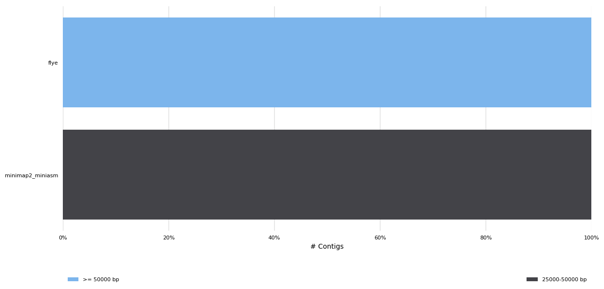
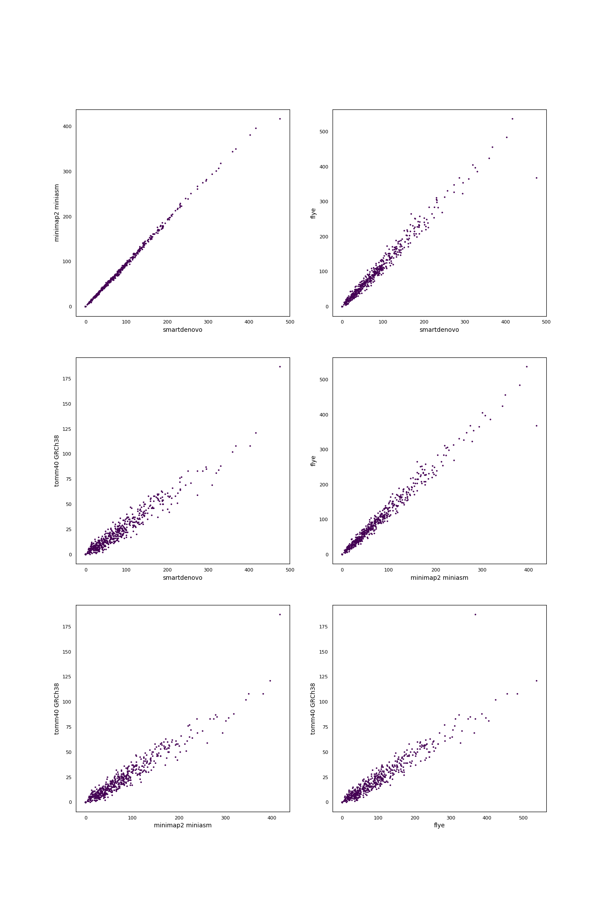

# Assembler benchmark for ONT MinION data
#### Authors: B. Honeydew
Generated using [poreTally](https://github.com/cvdelannoy/poreTally), a benchmarking tool. For an interactive version of this report, download REPORT.html from this repository.

<h2>Abstract</h2>The MinION is a portable DNA sequencer that generates long error-prone reads. As both the hardware and analysis software are updated regularly, the most suitable pipeline for subsequent analyses of a dataset generated with a given combination of hardware and software for a given organism is not always clear. Here we present a benchmark for a selection of <i>de novo</i> assemblers available to MinION users, on a read set of <i>human TOMM40 gene</i>. This benchmark is based on a <a href=\>benchmarking routine</a>, designed to facilitate easy replication on a read set of choice and addition of other <i>de novo</i> assembly pipelines.<h2>Methods</h2><h3>Readset quality assessment</h3>Reads in this dataset were generated on a Minion with FLO-MIN106 flowcell with SQK-LSK108 kit. The reads were basecalled using Albacore 2.2.7. Prior to assembly, the quality of the untreated readset was analysed using NanoPlot (version: 1.13.0) and mapped using Minimap2 (version: 2.10-r764-dirty).<h3>Assembly pipelines</h3><h4>minimap2 miniasm</h4>Minimap2 is a fast all-vs-all mapper of reads that relies on sketches of sequences, composed of minimizers. Miniasm uses the found overlaps to construct an assembly graph. As a consensus step is lacking in this pipeline, post-assembly polishing is often required. &zwnj; &zwnj;<b>Included tools:</b><ul><li>minimap2 (version: 2.10-r764-dirty) </li><li>miniasm (version: 0.2-r168-dirty) </li></ul> &zwnj;<b>Used command:</b><pre><code>${MINIMAP2} -x ava-ont -t ${NB_THREADS} ${INT}/all_reads.fastq ${INT}/all_reads.fastq | gzip -1 > ${INT}/assembler_results/minimap2_miniasm/minimap2.paf.gz && (${MINIASM} -f ${INT}/all_reads.fastq ${INT}/assembler_results/minimap2_miniasm/minimap2.paf.gz > ${INT}/assembler_results/minimap2_miniasm/minimap2_miniasm.gfa)
awk '/^S/{print ">"$2"\n"$3}' ${INT}/assembler_results/minimap2_miniasm/minimap2_miniasm.gfa | fold > ${INT}/assembler_results/minimap2_miniasm/minimap2_miniasm.fasta

cp ${INT}/assembler_results/minimap2_miniasm/minimap2_miniasm.fasta ${INT}/assembler_results/all_assemblies/minimap2_miniasm.fasta</code></pre><h4>canu</h4>Canu is a complete OLC assembly pipeline that was shown to work well for the assembly of error-prone  reads. It performs a  pre-assembly read correction, read trimming, assembly using the minhash alignment  process (MHAP) and ultimately a consensus finding step. &zwnj; &zwnj;<b>Included tools:</b><ul><li>canu (version: <$CANU --version | grep -Po '(?<=Canu ).+'>) </li></ul> &zwnj;<b>Used command:</b><pre><code>${CANU} -d ${INT}/assembler_results/canu -p canu_assembly maxThreads=${NB_THREADS} useGrid=false genomeSize=$REFGENOME_SIZE -nanopore-raw ${INT}/all_reads.fasta

cp ${INT}/assembler_results/canu/canu_assembly.contigs.fasta ${INT}/assembler_results/all_assemblies/canu.fasta</code></pre><h4>smartdenovo</h4>SMARTdenovo is a long read OLC assembly pipeline that was originally intended to work with  PacBio reads, but has been shown to produce assemblies of reasonably high continuity from MinION reads as well. &zwnj; &zwnj;<b>Included tools:</b><ul><li>SMARTdenovo (version: none defined) </li></ul> &zwnj;<b>Used command:</b><pre><code>${SMARTDENOVO} -p ${INT}/assembler_results/smartdenovo/smartdenovo_assembly ${INT}/all_reads.fasta > ${INT}/assembler_results/smartdenovo/smartdenovo_assembly.mak && (make -f ${INT}/assembler_results/smartdenovo/smartdenovo_assembly.mak)
if [ -e ${INT}/assembler_results/smartdenovo/smartdenovo_assembly.cns ]; then
	cp ${INT}/assembler_results/smartdenovo/smartdenovo_assembly.cns ${INT}/assembler_results/all_assemblies/smartdenovo.fasta
elif [ -e ${INT}/assembler_results/smartdenovo/smartdenovo_assembly.dmo.lay.utg ]; then
	cp ${INT}/assembler_results/smartdenovo/smartdenovo_assembly.dmo.lay.utg ${INT}/assembler_results/all_assemblies/smartdenovo.fasta
fi</code></pre><h4>flye</h4>Flye uses A-Bruijn graphs to assemble long error-prone reads. To do so, it follows arbitrary paths through the assembly graph and constructs new assembly graphs from these paths. &zwnj; &zwnj;<b>Included tools:</b><ul><li>flye (version: 2.3.4-g5b44fbe) </li></ul> &zwnj;<b>Used command:</b><pre><code>$FLYE --nano-raw ${INT}/all_reads.fastq --genome-size ${REFGENOME_SIZE} --out-dir ${INT}/assembler_results/flye/ --threads ${NB_THREADS}

cp ${INT}/assembler_results/flye/scaffolds.fasta ${INT}/assembler_results/all_assemblies/flye.fasta</code></pre><h4>minimap2 miniasm nanopolish</h4>Minimap2 is a fast all-vs-all mapper of reads that relies on sketches of sequences, composed of minimizers. Miniasm uses the found overlaps to construct an assembly graph. As a consensus step is lacking in this pipeline, post-assembly polishing is often required. In this case, Nanopolish was used. &zwnj; &zwnj;<b>Included tools:</b><ul><li>nanopolish (version: <${NANOPOLISH} --version | grep -Po '(?<=nanopolish version ).+'>) </li><li>minimap2 (version: <${MINIMAP2} -V>) </li><li>miniasm (version: <${MINIASM} -V>) </li></ul> &zwnj;<b>Used command:</b><pre><code>if [ "${FAST5_BOOL}" = "false"  ]; then
	echo 'No fast5 reads supplied, cannot execute this pipeline'
	exit 0
fi

${MINIMAP2} -x ava-ont -t ${NB_THREADS} ${INT}/all_reads.fastq ${INT}/all_reads.fastq | gzip -1 > ${INT}/assembler_results/minimap2_miniasm_nanopolish/minimap2.paf.gz && (${MINIASM} -f ${INT}/all_reads.fastq ${INT}/assembler_results/minimap2_miniasm_nanopolish/minimap2.paf.gz > ${INT}/assembler_results/minimap2_miniasm_nanopolish/minimap2_miniasm.gfa)
awk '/^S/{print ">"$2"\n"$3}' ${INT}/assembler_results/minimap2_miniasm_nanopolish/minimap2_miniasm.gfa | fold > ${INT}/assembler_results/minimap2_miniasm_nanopolish/minimap2_miniasm.fasta

${TOOL_DIR}/scripts/other/nanopolish_std.sh ${INT}/assembler_results/minimap2_miniasm_nanopolish/minimap2_miniasm.fasta ${INT}/extended_parameters.config ${INT}/all_reads.fastq

cp ${INT}/assembler_results/minimap2_miniasm_nanopolish/nanopolish/minimap2_miniasm_nanopolish.fasta ${INT}/assembler_results/all_assemblies/minimap2_miniasm_nanopolish.fasta</code></pre><h3>Assembly quality assessment</h3>Produced assemblies were analyzed and compared on continuity and agreement with the reference genome. Quast (version: 4.6.2) was used to determine a wide array of quality metrics in both quality categories and produce synteny plots. To elucidate any bias in the occurence of certain sequences, 5-mers in the assemblies and the reference genomes were compared using Jellyfish (version: 2.2.9). Finally, results were summarized using MultiQC.<h2>Results</h2><h3>General Statistics</h3><table>
<thead>
<tr><th style="text-align: center;">                           </th><th style="text-align: center;"> CPU time </th></tr>
</thead>
<tbody>
<tr><td style="text-align: center;">           canu            </td><td style="text-align: center;"> 0:00:34  </td></tr>
<tr><td style="text-align: center;">minimap2_miniasm_nanopolish</td><td style="text-align: center;"> 0:00:00  </td></tr>
<tr><td style="text-align: center;">           flye            </td><td style="text-align: center;"> 0:01:22  </td></tr>
<tr><td style="text-align: center;">     minimap2_miniasm      </td><td style="text-align: center;"> 0:00:00  </td></tr>
<tr><td style="text-align: center;">        smartdenovo        </td><td style="text-align: center;"> 0:00:01  </td></tr>
</tbody>
</table><h3>Readset quality</h3>
<table>
<thead>
<tr><th style="text-align: center;">                          </th><th style="text-align: center;"> Value </th><th style="text-align: center;">                 </th><th style="text-align: center;"> N  </th><th style="text-align: center;">  %  </th></tr>
</thead>
<tbody>
<tr><td style="text-align: center;"> <b>Mean read quality</b> </td><td style="text-align: center;">  9.1  </td><td style="text-align: center;"><b>insertions</b></td><td style="text-align: center;">1200</td><td style="text-align: center;">9.22 </td></tr>
<tr><td style="text-align: center;"><b>Median read quality</b></td><td style="text-align: center;">  9.4  </td><td style="text-align: center;"> <b>matches</b>  </td><td style="text-align: center;">8336</td><td style="text-align: center;">64.08</td></tr>
<tr><td style="text-align: center;"> <b>Mean read length</b>  </td><td style="text-align: center;">15401.7</td><td style="text-align: center;"><b>deletions</b> </td><td style="text-align: center;">927 </td><td style="text-align: center;">7.13 </td></tr>
<tr><td style="text-align: center;"><b>Median read length</b> </td><td style="text-align: center;"> 14488 </td><td style="text-align: center;"><b>mismatches</b></td><td style="text-align: center;">2546</td><td style="text-align: center;">19.57</td></tr>
</tbody>
</table><h3>QUAST</h3><h4>Assembly Statistics</h4><table>
<thead>
<tr><th style="text-align: center;">                </th><th style="text-align: center;"> Genome Fraction </th><th style="text-align: center;"> Largest contig (Kbp) </th><th style="text-align: center;"> N75 (Kbp) </th><th style="text-align: center;"> L75 (K) </th><th style="text-align: center;"> N50 (Kbp) </th><th style="text-align: center;"> Indels /100Kbp </th><th style="text-align: center;"> Mismatches /100Kbp </th><th style="text-align: center;"> Misas- semblies </th><th style="text-align: center;"> L50 (K) </th><th style="text-align: center;"> Length (Mbp) </th></tr>
</thead>
<tbody>
<tr><td style="text-align: center;">      flye      </td><td style="text-align: center;">     99.936      </td><td style="text-align: center;">        52920         </td><td style="text-align: center;">   52920   </td><td style="text-align: center;">    1    </td><td style="text-align: center;">   52920   </td><td style="text-align: center;">    1420.32     </td><td style="text-align: center;">       409.24       </td><td style="text-align: center;">       0.0       </td><td style="text-align: center;">    1    </td><td style="text-align: center;">    52920     </td></tr>
<tr><td style="text-align: center;">minimap2_miniasm</td><td style="text-align: center;">        -        </td><td style="text-align: center;">        41819         </td><td style="text-align: center;">   41819   </td><td style="text-align: center;">    1    </td><td style="text-align: center;">   41819   </td><td style="text-align: center;">       -        </td><td style="text-align: center;">         -          </td><td style="text-align: center;">        -        </td><td style="text-align: center;">    1    </td><td style="text-align: center;">    41819     </td></tr>
<tr><td style="text-align: center;">  smartdenovo   </td><td style="text-align: center;">        -        </td><td style="text-align: center;">        43959         </td><td style="text-align: center;">   43959   </td><td style="text-align: center;">    1    </td><td style="text-align: center;">   43959   </td><td style="text-align: center;">       -        </td><td style="text-align: center;">         -          </td><td style="text-align: center;">        -        </td><td style="text-align: center;">    1    </td><td style="text-align: center;">    43959     </td></tr>
</tbody>
</table><h4>Number of Contigs</h4>

<h3> <i>k</i>-mer Counts</h3>

<h3> Synteny Plots</h3>

